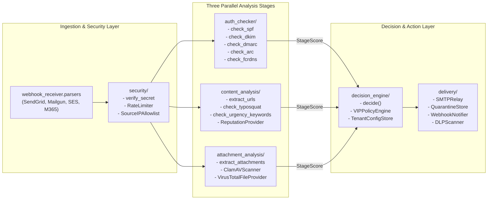
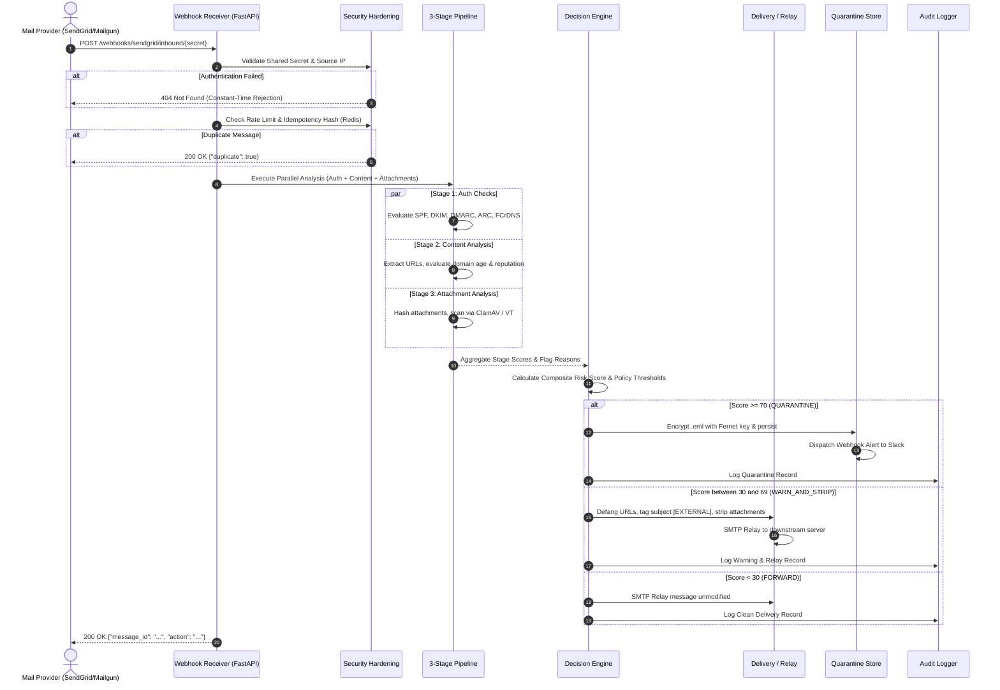

# Architecture & C4 Model — email-auth-gateway

## System Overview

`email-auth-gateway` is an enterprise-grade, multi-tenant email security gateway. Positioned between public inbound mail providers (SendGrid, Mailgun, AWS SES, Microsoft 365, Google Workspace) and internal mail infrastructure, it performs asynchronous, defense-in-depth analysis across three parallel evaluation stages before deciding whether to forward, warn-and-strip, or quarantine incoming messages.

---

## C4 Model Architecture

### Level 1: System Context Diagram

The System Context diagram illustrates how `email-auth-gateway` fits into the broader enterprise email and security ecosystem, identifying external actors, mail delivery systems, and downstream security tools.

```mermaid
graph TB
    subgraph Senders ["External Entities"]
        SenderMTA["Inbound Mail Providers<br/>(SendGrid, Mailgun, SES, M365, GWorkspace)"]
        ThreatActors["Malicious Senders<br/>(Spoofing, Phishing, Malware)"]
    end

    subgraph CoreGateway ["Email Security Perimeter"]
        Gateway["email-auth-gateway<br/>(Ingress Webhook, Parser, Decision Engine)"]
    end

    subgraph InternalSystems ["Internal Enterprise Infrastructure"]
        MTA["Downstream SMTP Relay / Mail Server<br/>(Postfix, Exchange, Zimbra)"]
        Recipients["Enterprise Mailboxes<br/>(Employees / Inboxes)"]
        SOC["Security Operations Center (SOC)<br/>(Incident Responders / Admins)"]
        SIEM["Enterprise SIEM / SOAR<br/>(Splunk, Elastic, Sentinel)"]
    end

    subgraph ExternalFeeds ["External Threat Intelligence"]
        VT["VirusTotal API<br/>(File & URL Reputation)"]
        GSB["Google Safe Browsing API<br/>(Phishing / Malware DB)"]
        RDAP["RDAP / WHOIS Registries<br/>(Domain Age Verification)"]
    end

    SenderMTA -->|HTTPS Webhook / SMTP| Gateway
    ThreatActors -.->|Exploit / Phishing Email| SenderMTA
    Gateway -->|Clean Email (Relay)| MTA
    MTA -->|Deliver| Recipients
    Gateway -->|Security Alerts & Digests| SOC
    SOC -->|Review Quarantine & Release via Admin API| Gateway
    Gateway -->|JSONL Audit & Metrics| SIEM
    Gateway -->|Reputation Lookups| VT
    Gateway -->|URL Scanning| GSB
    Gateway -->|Domain Age Check| RDAP
```

---

### Level 2: Container Diagram

The Container diagram decomposes `email-auth-gateway` into its independently deployable high-level execution components, microservices, and storage layers.

```mermaid
graph TB
    subgraph IngressBoundary ["Ingress Network Boundary"]
        LB["Cloud Load Balancer / Ingress<br/>(TLS Termination, WAF)"]
    end

    subgraph GatewayCluster ["Kubernetes Pod Cluster: email-auth-gateway"]
        FastAPIApp["FastAPI Application<br/>(Port 8000 / ASGI Uvicorn)<br/>- Inbound Webhook Endpoints<br/>- Admin API & Identity RBAC<br/>- SOC Dashboard UI"]
        PipelineWorker["Parallel Analysis Pipeline<br/>- Stage 1: Auth Checker (SPF, DKIM, DMARC, ARC)<br/>- Stage 2: Content Analysis (NLP, Typosquat, URLs)<br/>- Stage 3: Attachment Analysis (Hashes, ClamAV)"]
        DecisionEngine["Decision Engine & Policy Router<br/>- Score Accumulator<br/>- VIP Protection Engine<br/>- Multi-Tenant Rule Evaluator"]
        DeliveryRouter["Delivery & Notification Engine<br/>- Outbound SMTP Relay Client<br/>- DLP Content Stripper<br/>- Quarantine Storage Writer<br/>- Webhook / Slack Notifier"]
    end

    subgraph DataAndBacking ["Storage & Infrastructure Layer"]
        RedisKV[("Redis Cluster / Memory Store<br/>- Idempotency Deduplication<br/>- Distributed Token-Bucket Rate Limiter<br/>- Reputation & RDAP Caches")]
        DiskStorage[("Encrypted Quarantine & Raw Storage<br/>- Fernet AES-128-CBC / HMAC-SHA256<br/>- Tenant-Isolated Directories")]
        ClamAVDaemon["ClamAV Antivirus Daemon<br/>(clamd TCP:3310)<br/>- Local Stream Attachment Scanning"]
        AuditFile[("Append-Only JSONL Audit Store<br/>- Message Lifecycle Records<br/>- Admin Action Trail")]
    end

    LB -->|Route Inbound Traffic| FastAPIApp
    FastAPIApp --> PipelineWorker
    PipelineWorker --> DecisionEngine
    DecisionEngine --> DeliveryRouter
    FastAPIApp <-->|Rate Limit & Dedup| RedisKV
    PipelineWorker <-->|Cache Checks| RedisKV
    PipelineWorker -->|Scan Stream (TCP)| ClamAVDaemon
    DeliveryRouter -->|Store Encrypted .eml| DiskStorage
    DeliveryRouter -->|Append Event| AuditFile
    FastAPIApp -->|Query & Audit Log| AuditFile
```

---

### Level 3: Component Diagram

The Component diagram details the internal modules, pipelines, and class boundaries within `email-auth-gateway`.



---

### Level 4: Execution Sequence (Message Lifecycle)

The sequence diagram below traces the end-to-end processing of an inbound message from HTTP POST to delivery or quarantine.



---

## Security Boundaries & Trust Zones

The gateway establishes four distinct trust boundaries:

| Zone | Level | Components | Access Control |
|---|---|---|---|
| **Zone 1: Public Internet** | Untrusted | Inbound sender MTAs, webhooks, external attachments | Strict rate limiting, payload size caps, constant-time validation |
| **Zone 2: Ingress Boundary** | Semi-Trusted | `/webhooks/*`, `/healthz`, `/readyz` | Shared secrets, IP allowlists, HMAC signature verification |
| **Zone 3: Internal Mesh** | Trusted | Redis KV, ClamAV daemon, worker pipelines | mTLS encryption, network policies, private VPC isolation |
| **Zone 4: Admin & Audit** | Highly Privileged | `/admin/*`, SOC dashboard, raw file decryptor | Bearer token / JWT auth, RBAC roles (`admin`, `analyst`), JSONL audit trail |

---

## Scoring Architecture & Decision Matrix

Scores accumulate from individual stage checks into a composite risk total:

```
Risk Score = Score(Auth Checker) + Score(Content Analysis) + Score(Attachment Analysis) + VIP Penalty
```

- **`0 – 29` Points (`FORWARD`)**: Normal clean delivery.
- **`30 – 69` Points (`WARN_AND_STRIP`)**: Subject prefix `[SUSPICIOUS]`, defanged URLs (`hxxps://...`), attachments quarantined, relayed to user.
- **`70 – 100+` Points (`QUARANTINE`)**: Immediate halt of delivery; message encrypted at rest, admin alert dispatched, reviewable via SOC portal.
- **Malware Override**: Any verified malware hit from ClamAV or VirusTotal assigns `+100` points immediately, triggering unconditional quarantine regardless of allowlist rules.
