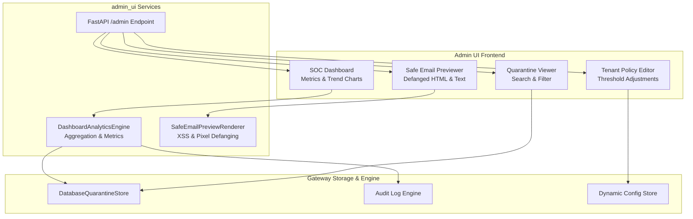

# Security Operations Center & Admin UI (`admin_ui`)

## Overview

The `admin_ui` module provides a browser-based Single Page Application (SPA) designed for Security Operations Center (SOC) teams, email administrators, and multi-tenant operators.

It provides real-time visibility into email flows, threat detection trends, quarantine message review, safe sandboxed previewing, and tenant policy configurations without requiring command-line access.



---

## Core Components

### 1. Web Application & Dashboard Template (`ui_app.py`)

The admin portal is served directly by the gateway at `/admin`. It requires no complex Node.js build pipeline or separate frontend container — it is rendered as an optimized, responsive SPA using vanilla JavaScript and CSS variables:

- **Metrics Cards**: Displays Total Scanned, Forwarded, Quarantined, and Rejected email volumes with percentage change indicators.
- **Threat Breakdown**: Visual distribution of detection categories (SPF/DKIM Spoof, BEC/Urgency, Malware Attachment, Malicious URL, Typosquatted Domain).
- **Recent Quarantine Table**: Searchable table displaying Message ID, Timestamp, Sender, Recipient, Threat Score, and Triggered Flags with one-click Release/Reject actions.
- **Tenant Switcher**: Allows multi-tenant administrators to pivot between client organizations.

---

### 2. Safe Email Preview Renderer (`sanitizer.py`)

When a SOC analyst reviews a suspicious email in quarantine, viewing the message directly could expose the analyst's workstation to stored XSS, tracking beacons, or drive-by downloads.

The `SafeEmailPreviewRenderer` creates an isolated, sandboxed inspection view:

```python
from admin_ui.sanitizer import SafeEmailPreviewRenderer

renderer = SafeEmailPreviewRenderer()

raw_hostile_html = """
<html>
  <body>
    <script>alert('Steal cookies');</script>
    
    <a href="https://malicious-login.com">Click to verify account</a>
  </body>
</html>
"""

safe_html = renderer.render_safe_preview(raw_hostile_html)
```

#### Sanitization Guarantees
1. **Script Elimination**: Strips `<script>`, `<object>`, `<embed>`, `<iframe>`, and `<applet>` tags.
2. **Event Handler Scrubbing**: Removes all `onload`, `onerror`, `onclick`, `onmouseover` attributes.
3. **Tracking Pixel Neutralization**: Strips external image tags or replaces them with user-approved placeholders to prevent sender notification.
4. **Link Defanging**: Rewrites active hyperlinks into inert plain-text indicators (e.g. `hxxps://malicious-login[.]com`).
5. **CSS Sandboxing**: Neutralizes absolute positioning, oversized overlays, and `display:none` obfuscation tricks.

---

### 3. Dashboard Analytics Engine (`dashboard_analytics.py`)

The `DashboardAnalyticsEngine` computes real-time operational aggregates:

```python
from admin_ui.dashboard_analytics import DashboardAnalyticsEngine

analytics = DashboardAnalyticsEngine(quarantine_store, audit_logger)

stats = await analytics.get_summary_metrics(tenant_id="tenant_finance", time_window_hours=24)
# Returns:
# {
#   "total_processed": 14250,
#   "clean_forwarded": 13820,
#   "quarantined": 380,
#   "rejected": 50,
#   "quarantine_rate_pct": 2.67,
#   "top_attacked_recipients": ["cfo@corp.com", "billing@corp.com"],
#   "top_threat_actors": ["198.51.100.44", "evil-spoofer.net"]
# }
```

---

## Security Features

- **Content Security Policy (CSP)**: The `/admin` route enforces strict CSP headers:
  ```http
  Content-Security-Policy: default-src 'self'; script-src 'self' 'unsafe-inline'; style-src 'self' 'unsafe-inline' https://fonts.googleapis.com; font-src https://fonts.gstatic.com; img-src 'self' data:;
  ```
- **CSRF Protection**: All administrative actions (releasing quarantine, updating policies) require a valid CSRF token header.
- **Audited Review**: Every release, rejection, or message inspection is permanently logged in the audit log with the analyst's identity and IP address.

---

## Testing

```bash
pytest tests/test_admin_ui.py -v
```
