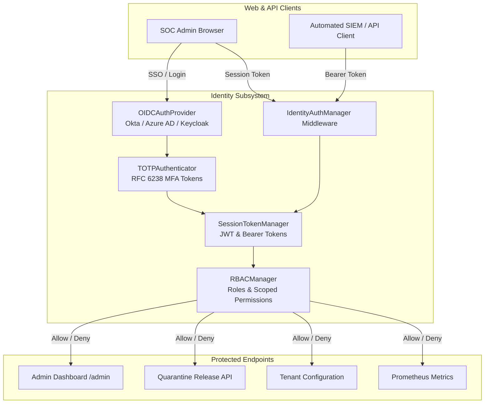

# Identity, Authentication & Access Control (`identity`)

## Overview

The `identity` module provides enterprise-grade authentication, Single Sign-On (SSO), Multi-Factor Authentication (MFA/TOTP), Role-Based Access Control (RBAC), and session management for administrators, SOC analysts, and tenant operators interacting with the gateway.



---

## Core Components

### 1. User Models & Password Hashing (`models.py`)

Stores user credentials, tenant associations, and role assignments.

```python
from identity.models import User, hash_password, verify_password

# Secure Argon2id / PBKDF2 hashing
hashed = hash_password("SuperSecretPassword123!")
assert verify_password("SuperSecretPassword123!", hashed) is True

user = User(
    username="soc_analyst_01",
    email="analyst@corp.internal",
    tenant_id="tenant_finance",
    role="analyst",
    mfa_enabled=True,
    mfa_secret="JBSWY3DPEHPK3PXP"
)
```

---

### 2. Role-Based Access Control (`rbac.py`)

The `RBACManager` maps system roles to explicit operational privileges.

| Role | Description | Permissions |
|---|---|---|
| `super_admin` | Global platform administrator | Full system access across all tenants |
| `tenant_admin` | Organization security administrator | View/release own tenant quarantine, manage tenant rules |
| `analyst` | SOC Incident Responder | View quarantine details, export audit logs, trigger rescans |
| `auditor` | Compliance & Governance Officer | Read-only access to audit logs and compliance reports |

```python
from identity.rbac import RBACManager

rbac = RBACManager()

# Check permissions
can_release = rbac.has_permission(role="analyst", permission="quarantine:release")
can_purge = rbac.has_permission(role="analyst", permission="system:purge_logs")
# can_release == True, can_purge == False
```

---

### 3. Session & JWT Management (`tokens.py`)

Handles cryptographic token generation and verification.

- `SessionTokenManager`: Issues signed JWT tokens containing user ID, tenant ID, role, and expiration timestamps.
- Enforces strict token expiry and supports instant server-side invalidation/revocation via Redis blacklist.
- Distinguishes between interactive human session tokens (1-hour lifespan) and long-lived service API keys.

---

### 4. Multi-Factor Authentication (`mfa.py`)

Implements RFC 6238 Time-Based One-Time Passwords (TOTP) compatible with Google Authenticator, Microsoft Authenticator, and 1Password.

```python
from identity.mfa import TOTPAuthenticator

auth = TOTPAuthenticator()
secret = auth.generate_secret()
provisioning_uri = auth.get_provisioning_uri(username="admin@corp.com", secret=secret)

# Verify 6-digit token submitted by user
is_valid = auth.verify_token(secret=secret, token="549102")
```

---

### 5. Enterprise Single Sign-On (`sso.py`)

`OIDCAuthProvider` integrates with corporate identity providers via OpenID Connect (OIDC) / SAML 2.0:
- Okta
- Microsoft Entra ID (Azure AD)
- PingFederate / Google Workspace
- Keycloak

Handles the authorization code exchange, state nonce verification, and automatic Just-In-Time (JIT) provisioning of user accounts.

---

### 6. Fast-Path Auth Middleware (`middleware.py`)

`IdentityAuthManager` decorates FastAPI endpoints, extracting the bearer token or session cookie, verifying tenant boundaries, and injecting the authenticated `User` context into request handlers.

---

## Testing

```bash
pytest tests/test_identity.py -v
```
