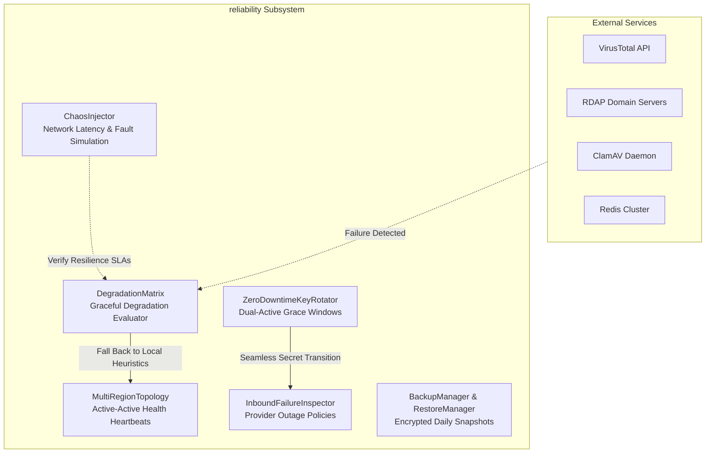

# High Availability, Disaster Recovery & Reliability (`reliability`)

## Overview

The `reliability` subsystem ensures that the email security gateway remains operational, resilient to regional outages, and capable of zero-downtime secret rotations.

It includes automated backup/restore verification, chaos engineering fault injection, active-active multi-region topology health tracking, zero-downtime key rotation windows, and the formal **"What Still Works When X Is Down"** Graceful Degradation Matrix.



---

## Core Components

### 1. Graceful Degradation Matrix (`degradation_matrix.py`)

A security gateway must never drop legitimate email or allow uninspected threats to pass silently when external dependencies fail. The `DegradationMatrix` classifies capabilities and verifies fallback safety:

```python
from reliability.degradation_matrix import DegradationMatrix

matrix = DegradationMatrix()

# Evaluate system state when ClamAV and VirusTotal are offline
report = matrix.evaluate_degraded_pipeline(down_services=["clamav", "virustotal"])

print(report.degradation_level)  # "DEGRADED"
print(report.safe_to_operate)     # True
print(report.fallback_actions)
# [
#   "Fallback to heuristic & local rule checks for virustotal",
#   "Fallback to heuristic & local rule checks for clamav"
# ]
```

#### Capability Guarantees Under Dependency Failure

| Failed Component | Failure Mode | Gateway Behavior | Degradation State |
|---|---|---|---|
| **VirusTotal API** | Circuit Breaker Opens | Skips cloud hash/URL lookup; relies on local heuristics and feed cache | Safe / Degraded |
| **ClamAV Daemon** | Socket Timeout / Fail Open | Scans extension & MIME headers; applies attachment risk heuristics | Safe / Degraded |
| **RDAP / Whois** | Connection Refused | Treats domain age as unknown (0 bonus points); logs warning | Safe / Degraded |
| **Redis** | Redis Down | Falls back immediately to thread-safe in-memory cache & rate limiter | Safe / Degraded |
| **Relay SMTP** | Connection Down | Retains message in encrypted queue; triggers automatic backoff retry | Resilient Hold |

---

### 2. Inbound Provider Failure & Outage Inspector (`inbound_failure_policy.py`)

Different inbound email providers behave differently when a gateway suffers a network outage or returns HTTP 5xx errors. The `InboundFailureInspector` formalizes these SLAs and calculates outage risk:

```python
from reliability.inbound_failure_policy import InboundFailureInspector

inspector = InboundFailureInspector()

# Check impact of a 4-hour maintenance outage on SendGrid inbound webhooks
report = inspector.calculate_outage_impact(provider_name="sendgrid", outage_hours=4.0)

assert report.mail_lost is False
assert report.retries_expected is True
# SendGrid queues inbound webhooks and retries delivery for up to 72 hours
```

#### Inbound Provider Retention SLAs

| Provider | Max Retry Retention | Backoff Strategy | Bounces on Failure? |
|---|---|---|---|
| **SendGrid Inbound Parse** | 72 Hours | Exponential backoff | No (Retries until expired) |
| **AWS SES / SNS** | 84 Hours | Automatic backoff + DLQ | No (Retains in SNS topic) |
| **Mailgun Routes** | 80 Hours | Periodic webhook retry | No (Drops after 80h) |
| **Microsoft 365** | 24 Hours | Mail-flow queue backoff | Generates NDR after 24h |
| **Standard Postfix MTA** | 120 Hours (5 Days) | Deferred queue retry | Generates DSN after 5d |

---

### 3. Zero-Downtime Secret & Key Rotation (`key_rotation.py`)

Rotating cryptographic keys, webhook secrets, or API tokens must never cause in-flight requests to fail.

`ZeroDowntimeKeyRotator` maintains an overlapping grace window where both the newly rotated key and the outgoing key remain valid:

```python
from reliability.key_rotation import ZeroDowntimeKeyRotator

rotator = ZeroDowntimeKeyRotator()
rotator.set_primary_secret("webhook_secret", "old-secret-version-1")

# Rotate to new secret with 1-hour grace window
rotator.rotate_secret("webhook_secret", "new-secret-version-2", grace_period_seconds=3600.0)

# Both secrets are valid during the grace window!
assert rotator.is_valid_secret("webhook_secret", "new-secret-version-2") is True
assert rotator.is_valid_secret("webhook_secret", "old-secret-version-1") is True
```

---

### 4. Backup & Disaster Recovery (`backup.py` & `restore.py`)

- `BackupManager`: Creates AES-256 encrypted snapshots of quarantine storage, SQLite/PostgreSQL databases, and tenant configuration.
- `RestoreManager`: Performs automated test restorations into isolated sandbox environments, validating cryptographic hash integrity and schema consistency before certifying a backup.

---

### 5. Multi-Region Active-Active Topology (`topology.py`)

`MultiRegionTopology` aggregates health heartbeats from gateway clusters deployed across multiple cloud regions (e.g. `us-east-1`, `eu-west-1`, `ap-southeast-1`), dynamically adjusting DNS routing and traffic splits if a region experiences latency degradation.

---

### 6. Chaos Engineering Injector (`chaos_injector.py`)

Validates system resilience in staging environments by programmatically injecting simulated network latency, packet loss, DNS lookup timeouts, and database disconnects.

---

## Testing

```bash
pytest tests/test_reliability.py -v
```
