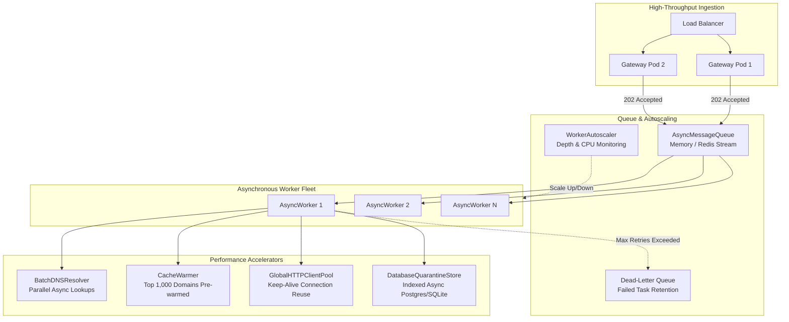

# High Scalability & Asynchronous Processing (`scalability`)

## Overview

The `scalability` subsystem enables the gateway to process enterprise-scale email volumes (10,000+ messages/minute) with sub-second HTTP ingestion latencies, horizontal worker autoscaling, and resilient backpressure handling.

It decouples the initial HTTP ingestion endpoint from heavy analysis tasks (DNS lookups, ClamAV attachment scanning, RDAP queries, and VirusTotal evaluations) using an asynchronous queue architecture with a Dead-Letter Queue (DLQ).



---

## Core Components

### 1. Asynchronous Message Queue & DLQ (`message_queue.py`)

Decouples inbound webhook ingestion from inspection execution:

```python
from scalability.message_queue import AsyncMessageQueue, AsyncWorkerPool

queue = AsyncMessageQueue(maxsize=50000)

# Ingest handler immediately returns 202 Accepted
task_id = await queue.enqueue(payload={"sender": "user@example.com", "raw_mime": "..."}, max_retries=3)

# Worker pool processes tasks concurrently
async def process_task(task):
    # Perform full auth, content, and virus checks
    ...

pool = AsyncWorkerPool(queue=queue, handler=process_task, concurrency=16)
await pool.start()
```

#### Dead-Letter Queue (DLQ) Semantics
If a transient downstream outage (e.g. database disconnect, external API timeout) prevents a message from completing processing:
1. The worker calls `nack(task, error_reason)`.
2. The queue retries the task with exponential backoff.
3. Once `max_retries` (default: 3) is exceeded, the task is moved to `_dlq` without dropping the email. Operators can inspect and re-drive DLQ messages via the Admin API.

---

### 2. Dynamic Worker Autoscaler (`autoscaler.py`)

`WorkerAutoscaler` continuously samples queue depth and processing latency to dynamically adjust active worker concurrency.

```python
from scalability.autoscaler import WorkerAutoscaler, AutoscalerConfig

config = AutoscalerConfig(
    min_workers=4,
    max_workers=64,
    scale_up_threshold_queue_depth=100,
    scale_down_threshold_queue_depth=10,
    cooldown_seconds=15.0
)

autoscaler = WorkerAutoscaler(worker_pool=pool, config=config)
await autoscaler.evaluate_and_adjust()
```

---

### 3. Batch Asynchronous DNS Resolution (`batch_dns.py`)

A single email can trigger 5–10 DNS lookups (SPF TXT, MX records, DKIM public key TXT, DMARC TXT, connecting IP PTR, and A records for URL domains).

`BatchDNSResolver` executes these lookups concurrently using `asyncio.gather` with built-in DNS caching, reducing total DNS wait time from ~350ms to <35ms per message.

```python
from scalability.batch_dns import BatchDNSResolver

resolver = BatchDNSResolver()
results = await resolver.batch_resolve_records([
    ("example.com", "TXT"),
    ("default._domainkey.example.com", "TXT"),
    ("_dmarc.example.com", "TXT"),
    ("relay.example.com", "A")
])
```

---

### 4. Cache Pre-Warming (`cache_warmer.py`)

In enterprise email traffic, 80%+ of inbound messages arrive from top commercial domains (Google, Microsoft 365, Amazon SES, Salesforce, SendGrid, Mailchimp).

`CacheWarmupEngine` proactively resolves and caches SPF, DKIM selectors, and DMARC policies for `DEFAULT_FREQUENT_DOMAINS` on container startup, eliminating cold-start latency spikes.

---

### 5. Persistent Indexed Quarantine Store (`db_store.py`)

`DatabaseQuarantineStore` provides high-throughput storage for quarantined messages and metadata:
- Supports PostgreSQL (`asyncpg`) and SQLite.
- Uses indexed columns on `(tenant_id, created_at, sender, recipient, threat_level)` for instant pagination and filtering across millions of records.
- Stores encrypted MIME payloads safely in byte blobs.

---

### 6. High-Performance HTTP Connection Pooling (`http_pool.py`)

Reuses persistent HTTP/2 connections with keep-alive across external API calls (VirusTotal, RDAP, webhooks, cloud threat feeds), avoiding the overhead of TLS handshakes on every request.

---

### 7. Automated Load Testing Harness (`load_test.py`)

Simulates synthetic high-concurrency traffic bursts to validate gateway throughput and latency SLAs:

```bash
# Run a synthetic burst of 1,000 messages across 20 concurrent connections
python -m scalability.load_test --rate 100 --duration 10 --concurrency 20
```

---

## Testing

```bash
pytest tests/test_scalability.py -v
```
