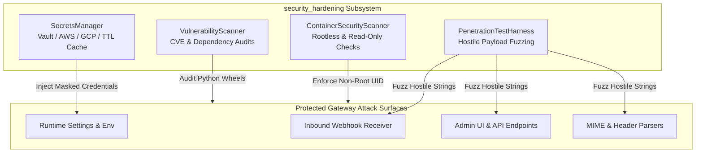

# Security Hardening & Penetration Testing (`security_hardening`)

## Overview

The `security_hardening` module enforces proactive defense-in-depth across the gateway's codebase, container images, secret stores, and API endpoints.

It provides automated fuzzing, penetration testing harnesses, static container image vulnerability scanning, dependency CVE checks, and pluggable cloud secrets management (HashiCorp Vault, AWS Secrets Manager, GCP Secret Manager).



---

## Core Components

### 1. Inbound Webhook & API Penetration Testing Harness (`pen_testing_harness.py`)

The `PenetrationTestHarness` automatically fuzzes gateway input parsers, webhook endpoints, and Admin APIs with real-world exploit strings:

- **SQL Injection**: `' OR '1'='1`, `'; DROP TABLE quarantine; --`
- **OS Command Injection**: `; cat /etc/passwd`, `$(whoami)`, `` `id` ``
- **Path Traversal**: `../../../../etc/passwd`, `..\..\..\windows\system32\...`
- **XSS & HTML Injection**: `<script>alert('xss')</script>`, `<iframe src=javascript:alert(1)>`
- **ReDoS / Resource Exhaustion**: Oversized 100KB repetitive string sequences and exponential backtracking regex triggers `(a+)+$`

```python
from security_hardening.pen_testing_harness import PenetrationTestHarness

harness = PenetrationTestHarness()

# Fuzz an ingestion function
result = harness.run_fuzz_test(target_func=gateway_ingest_handler)

print(f"Tests run: {result.total_tests}")
print(f"Passed: {result.passed}, Failed: {result.failed}")
assert len(result.vulnerabilities_detected) == 0
```

---

### 2. Cloud Secrets Manager Integration (`secrets_manager.py`)

Hardcoding secrets in environment variables or configuration files risks credential leakage via process table inspection or container dumps.

`SecretsManager` integrates with cloud key vaults while maintaining performance via a TTL-based in-memory cache:

```python
from security_hardening.secrets_manager import SecretsManager

# Initialize with HashiCorp Vault or AWS Secrets Manager
sm = SecretsManager(provider="aws_secrets_manager", cache_ttl_seconds=300.0)

# Retrieve secret with automatic credential masking in logs
api_key = sm.get_secret("VIRUSTOTAL_API_KEY")
masked = sm.mask_secret(api_key)  # "9f2...8b1"
```

#### Supported Backends
- **AWS Secrets Manager** (`AWS_SECRET_*` & AWS SDK)
- **HashiCorp Vault** (`VAULT_SECRET_*` & Vault API)
- **GCP Secret Manager** (`GCP_SECRET_*` & Google Cloud Secret Manager)
- **Local Environment Variables** (Fallback for development/testing)

---

### 3. Container & Runtime Security Scanner (`container_scanner.py`)

`ContainerSecurityScanner` audits running container environments and Dockerfiles against CIS Benchmark security guidelines:

1. **Non-Root Execution**: Verifies process UID != 0 (e.g. `gateway` user UID 10001).
2. **Read-Only Root Filesystem**: Confirms root filesystem is mounted read-only, preventing attackers from writing persistent implants.
3. **Dropped Linux Capabilities**: Ensures `ALL` capabilities are dropped, with only `NET_BIND_SERVICE` granted if binding privileged ports.
4. **No New Privileges**: Asserts `allowPrivilegeEscalation: false` is active in the Kubernetes security context.

---

### 4. Vulnerability & CVE Scanner (`vulnerability_scanner.py`)

The `VulnerabilityScanner` scans installed Python packages against known vulnerability databases (OSV, PyPA Advisory Database, Safety DB).

- Flags vulnerable package versions before deployment.
- Categorizes findings by CVSS severity (`CRITICAL`, `HIGH`, `MEDIUM`, `LOW`).
- Generates machine-readable SARIF reports for GitHub Security Code Scanning integration.

---

## Verification & Hardening Checklist

- [x] Inbound webhook secret validation runs with constant-time HMAC comparison (`hmac.compare_digest`).
- [x] All database queries use parameterized SQL; no raw string interpolation.
- [x] HTML email bodies are sanitized before SOC analyst previewing.
- [x] HTTP request bodies are limited to 25MB to prevent memory exhaustion DoS.
- [x] External URL redirects and DNS queries enforce SSRF protection filters.
- [x] Webhook endpoints respond with HTTP 404 (not 401) on missing secrets to prevent path enumeration.

---

## Testing

```bash
pytest tests/test_security_hardening.py -v
```
