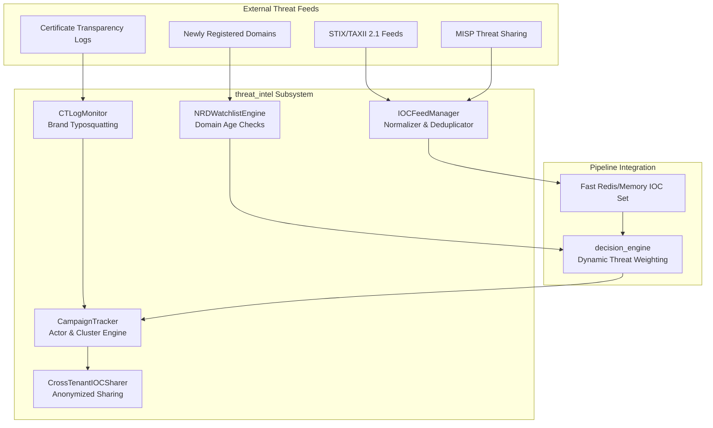

# Threat Intelligence Engine (`threat_intel`)

## Overview

The `threat_intel` subsystem integrates external Indicators of Compromise (IOCs), certificate transparency logs, malware information sharing platforms (MISP), STIX/TAXII feeds, and cross-tenant threat correlation into the gateway's real-time inspection pipeline.

It empowers the gateway to detect emerging targeted campaigns, typosquatted brand domains, and zero-day command-and-control (C2) infrastructure before commercial blocklists have updated.



---

## Core Components

### 1. Feed Ingestion (`feed_ingestion.py`)

The `IOCFeedManager` consumes threat intelligence feeds from flat text files (URLs, IPs, domain lists, hash blocklists) and JSON structured lists.

```python
from threat_intel.feed_ingestion import IOCFeedManager

feed_mgr = IOCFeedManager()

# Ingest plain text IP blocklist
added_ips = feed_mgr.ingest_feed(
    feed_name="spamhaus_drop",
    feed_type="ip",
    content="198.51.100.1\n203.0.113.50 # C2 node\n"
)

# Ingest JSON threat feed
added_domains = feed_mgr.ingest_feed(
    feed_name="phish_feed",
    feed_type="domain",
    content='{"items": ["paypa1-security.com", "secure-bank-login.xyz"]}'
)

# Real-time membership check
is_malicious = feed_mgr.is_blacklisted("paypa1-security.com", "domain")
```

#### Key Capabilities
- Normalizes and lowercases IP addresses, domain names, and cryptographic hashes (MD5, SHA256).
- Deduplicates indicators across multiple feed providers.
- Records ingestion metadata (timestamp, item count, feed origin).

---

### 2. STIX / TAXII 2.1 Integration (`stix_taxii.py`)

`STIXTAXIIClient` polls TAXII 2.1 servers and translates STIX 2.1 `indicator` objects into gateway blocklist entries.

- Parses STIX pattern expressions (e.g. `[file:hashes.'SHA-256' = '...']`, `[domain-name:value = '...']`, `[ipv4-addr:value = '...']`).
- Handles TAXII pagination and collections discovery.
- Supports HTTP Basic Auth and API bearer tokens.

---

### 3. MISP Integration (`misp_integration.py`)

`MISPIntegrationClient` synchronizes indicators with Malware Information Sharing Platform (MISP) instances.

- Queries MISP REST API for attributes with `to_ids=True`.
- Maps MISP categories (`Network activity`, `Payload delivery`, `External analysis`) to gateway internal IOC types.
- Supports bidirectional reporting: when the gateway captures a confirmed high-confidence zero-day attachment or phishing URL, it can publish an event back to MISP.

---

### 4. Certificate Transparency Log Monitoring (`ct_monitor.py`)

The `CTLogMonitor` proactively inspects Certificate Transparency (CT) log streams for TLS certificates issued to domains mimicking protected corporate brands.

```python
from threat_intel.ct_monitor import CTLogMonitor

ct_mon = CTLogMonitor(brand_domains=["acmecorp.com", "mybank.org"])

# Check if a newly observed domain is an impersonation attempt
result = ct_mon.is_lookalike_domain("acme-corp-login.com")
# Returns: ('acmecorp.com', 0) -> Substring impersonation detected

result2 = ct_mon.is_lookalike_domain("acmec0rp.com")
# Returns: ('acmecorp.com', 1) -> Levenshtein edit distance = 1
```

#### Detection Logic
1. **Exact match**: Excluded (legitimate brand domain).
2. **Levenshtein Distance**: Detects character swaps, insertions, deletions (distance 1-2).
3. **Substring Impersonation**: Catches prefixed/suffixed variations like `acmecorp-verify.com` or `login.acmecorp.net.cn`.

---

### 5. Newly Registered Domains Watchlist (`nrd_watchlist.py`)

Attackers frequently register throwaway domains minutes before launching spear-phishing runs.

- `NRDWatchlistEngine` tracks domains registered within the last 1–30 days.
- Injects an automatic risk penalty (e.g. +35 to +50 points) in the `decision_engine` for any inbound email originating from an NRD.

---

### 6. Campaign Clustering & Threat Actor Tracking (`campaign_tracker.py`)

`CampaignTracker` groups individual threat events into cohesive campaigns based on shared infrastructure, subject patterns, and payload signatures.

```python
from threat_intel.campaign_tracker import CampaignTracker

tracker = CampaignTracker()

# Record first incident
c1 = tracker.record_incident(
    sender_ip="198.51.100.22",
    domain="urgent-invoice-auth.com",
    attachment_hash="a1b2c3d4e5f6...",
    subject="Overdue Payment Notice #9042",
    threat_type="credential_harvesting"
)

# Record second incident with shared attachment hash but different IP
c2 = tracker.record_incident(
    sender_ip="203.0.113.99",
    domain="billing-update-portal.info",
    attachment_hash="a1b2c3d4e5f6...",
    subject="Final Notice #9042"
)

# Automatically grouped into the same campaign ID!
assert c1["campaign_id"] == c2["campaign_id"]
```

---

### 7. Cross-Tenant IOC Sharing (`cross_tenant_sharing.py`)

In a multi-tenant enterprise deployment, an attack targeting Tenant A can immediately protect Tenant B, C, and D without leaking sensitive PII or corporate data.

- Strips recipient headers, tenant IDs, and internal IP subnets.
- Normalizes threat indicators into sanitized JSON packages.
- Propagates shared IOCs to the global gateway threat cache within milliseconds.

---

## Configuration Reference

| Setting | Default | Description |
|---|---|---|
| `THREAT_INTEL_ENABLED` | `true` | Globally enable or disable threat intelligence lookups |
| `TAXII_SERVER_URL` | `""` | URL of TAXII 2.1 discovery endpoint |
| `TAXII_COLLECTION_ID` | `""` | Target TAXII collection identifier |
| `MISP_URL` | `""` | Base URL of corporate MISP instance |
| `MISP_API_KEY` | `""` | Auth key for MISP API queries |
| `CT_MONITOR_BRANDS` | `""` | Comma-separated list of brand domains to protect |
| `NRD_MAX_AGE_DAYS` | `14` | Threshold in days below which a domain is flagged as NRD |
| `CROSS_TENANT_SHARE_ENABLED` | `false` | Enable automatic sanitized IOC propagation across tenants |

---

## Testing

Comprehensive unit and integration tests are available in `tests/test_threat_intel.py`:
```bash
pytest tests/test_threat_intel.py -v
```
