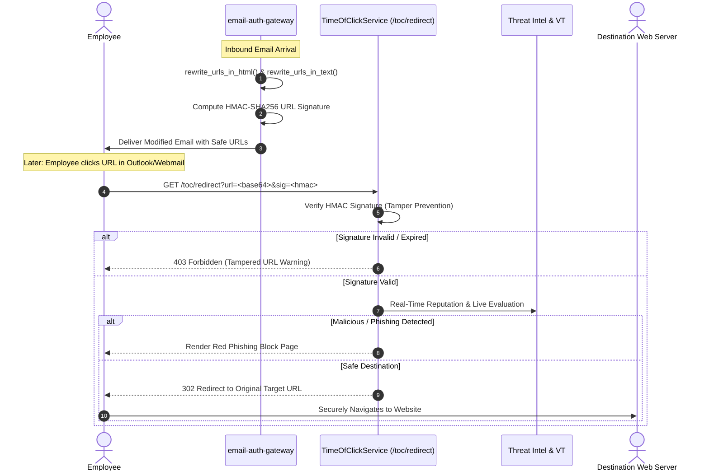

# Time-of-Click URL Protection (`time_of_click`)

## Overview

Phishing attackers frequently send emails containing benign links that later weaponize into malicious credential-harvesting pages or malware payloads *after* the email has passed inbound security inspection and arrived in the recipient's inbox.

The `time_of_click` module neutralizes this vector by rewriting URLs in inbound emails so they route through the gateway's secure redirection proxy. When a user clicks a link, the gateway re-evaluates the destination URL in real time against reputation databases and threat feeds before deciding whether to allow or block the navigation.



---

## Core Components

### 1. URL Rewriter (`rewriter.py`)

The URL rewriter parses HTML email bodies and plain text message parts, replacing target HTTP/HTTPS URLs with signed redirection links.

```python
from time_of_click.rewriter import rewrite_urls_in_html, rewrite_urls_in_text

gateway_base = "https://gateway.corp.internal"
secret_key = "gateway-secret-token"

raw_html = '<p>Click <a href="https://example.com/login">here</a></p>'
rewritten_html, count = rewrite_urls_in_html(raw_html, gateway_base, secret_key)
# rewritten_html now points to:
# https://gateway.corp.internal/toc/redirect?url=aHR0cHM6Ly9leGFtcGxlLmNvbS9sb2dpbg==&sig=7d8a9f...
```

#### Key Functions
- `generate_url_signature(target_url: str, secret_key: str) -> str`: Generates an HMAC-SHA256 signature truncated to 16 hex characters to prevent parameter tampering.
- `create_toc_url(target_url: str, gateway_base_url: str, secret_key: str) -> str`: Encodes the original URL in URL-safe Base64 and appends signature query parameters.
- `rewrite_urls_in_html(html_content: str, ...) -> Tuple[str, int]`: Scans all `<a href="...">` attributes with regex matching while preserving non-HTTP links (`mailto:`, `tel:`) and existing `/toc/redirect` links.
- `rewrite_urls_in_text(text_content: str, ...) -> Tuple[str, int]`: Discovers bare URLs in plain text email bodies and rewrites them in place.

---

### 2. Time-of-Click Evaluation Service (`service.py`)

The `TimeOfClickService` powers the `/toc/redirect` endpoint.

```python
from time_of_click.service import TimeOfClickService

service = TimeOfClickService(
    secret_key="gateway-secret-token",
    threat_intel_client=threat_client
)

# Handle user click
response = await service.handle_click(encoded_url=url_param, signature=sig_param)

if response.action == "ALLOW":
    return RedirectResponse(url=response.target_url, status_code=302)
else:
    return HTMLResponse(content=response.block_page_html, status_code=403)
```

#### Evaluation Pipeline at Click Time
1. **Signature Validation**: Ensures the URL has not been tampered with or modified by an attacker attempting to use the gateway as an open redirector.
2. **Domain Reputation Check**: Queries local cache, Redis threat sets, and external feeds (e.g. VirusTotal, Google Safe Browsing).
3. **Redirect Chain Tracing**: Follows URL shorteners (e.g. `bit.ly`, `tinyurl.com`) up to 5 hops to analyze the true landing page.
4. **Action Determination**:
   - `ALLOW`: Issues an HTTP 302 redirect directly to the target.
   - `BLOCK`: Renders an educational, branded warning page displaying why the destination was deemed hazardous.

---

## Security Considerations

### Open Redirect Prevention
Without cryptographic verification, URL rewriting services can become open redirectors exploited by phishing actors to lend legitimacy to malicious links.
- The gateway binds every URL with an HMAC-SHA256 signature generated using a private server secret.
- Requests with mismatched or absent signatures are immediately aborted with HTTP 403.

### SSRF Protection in Real-Time Lookups
When inspecting destination URLs or following redirect chains:
- Private IP ranges (`10.0.0.0/8`, `172.16.0.0/12`, `192.168.0.0/16`), loopback (`127.0.0.1`), and link-local (`169.254.169.254`) are strictly blocked.
- DNS resolution is verified prior to making HTTP head requests.

---

## Configuration

| Environment Variable | Default | Description |
|---|---|---|
| `TOC_ENABLED` | `false` | Enable or disable Time-of-Click link rewriting on inbound mail |
| `TOC_BASE_URL` | `""` | Public hostname of the gateway (e.g. `https://toc.security.corp`) |
| `TOC_SECRET_KEY` | `""` | Dedicated secret key used for HMAC signing of rewritten links |
| `TOC_MAX_REDIRECT_HOPS` | `5` | Maximum redirects followed during destination analysis |
| `TOC_BLOCK_PAGE_TITLE` | `"Security Warning"` | Header text displayed on blocked link pages |

---

## Testing

Run the test suite with:
```bash
pytest tests/test_time_of_click.py -v
```
