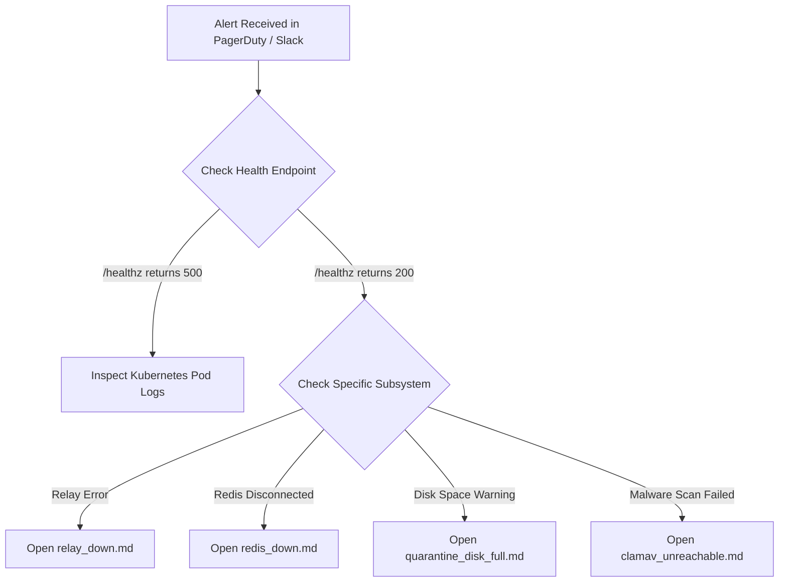

# On-Call Incident Response & Operational Runbooks

Welcome to the **Email Authentication Gateway** on-call operational guide. This directory contains actionable, step-by-step runbooks for resolving production incidents.

---

## 1. Incident Severity Definitions

| Severity | Description | Target Response Time | Escalation Path |
| :--- | :--- | :--- | :--- |
| **SEV-1 (Critical)** | Entire mail flow halted; all inbound webhooks failing or SMTP relay completely blocked. | **< 15 minutes** | Primary On-Call -> SecOps Lead -> Engineering Director |
| **SEV-2 (High)** | Degradation in detection pipeline; Redis/ClamAV down causing fallback to degraded mode; quarantine storage > 85% full. | **< 30 minutes** | Primary On-Call -> Secondary On-Call |
| **SEV-3 (Moderate)** | Non-blocking external threat intel API failure (e.g. VirusTotal quota exhausted); latency elevated but mail passing. | **< 2 hours** | Primary On-Call |
| **SEV-4 (Low)** | Minor cosmetic UI issue, non-urgent log warnings, routine secret rotation. | **Next business day** | Jira Backlog |

---

## 2. Quick Incident Index

| Alert / Symptom | Trigger Condition | Runbook Link |
| :--- | :--- | :--- |
| **`RelayDown` / `RelayTimeout`** | Outbound SMTP relay connection refused, auth failure, or 100% send failure. | [Relay Down Runbook](file:///home/drac/Documents/coding/email-auth-gateway/docs/runbooks/relay_down.md) |
| **`RedisClusterUnreachable`** | Redis heartbeat failure; gateway fallback to degraded in-memory mode. | [Redis Down Runbook](file:///home/drac/Documents/coding/email-auth-gateway/docs/runbooks/redis_down.md) |
| **`QuarantineDiskFull`** | Storage volume utilization > 85%; risk of rejecting new quarantined items. | [Quarantine Disk Full Runbook](file:///home/drac/Documents/coding/email-auth-gateway/docs/runbooks/quarantine_disk_full.md) |
| **`KeyRotationRequired`** | Scheduled 90-day secret rotation or credential leak remediation. | [Key Rotation Runbook](file:///home/drac/Documents/coding/email-auth-gateway/docs/runbooks/key_rotation.md) |
| **`ClamAVUnreachable`** | ClamAV daemon crash or socket timeout; attachment scanner bypassed. | [ClamAV Unreachable Runbook](file:///home/drac/Documents/coding/email-auth-gateway/docs/runbooks/clamav_unreachable.md) |

---

## 3. General Triage Workflow



### Essential Triage Commands

```bash
# 1. Check Pod Status and Restarts in Production
kubectl get pods -n email-security-prod -l app.kubernetes.io/name=email-auth-gateway

# 2. View Recent Container Logs
kubectl logs -n email-security-prod -l app.kubernetes.io/name=email-auth-gateway --tail=100 -f

# 3. Check Real-Time Healthz Probe
kubectl exec -it deployment/email-auth-gateway -n email-security-prod -- curl -s http://localhost:8000/healthz

# 4. View HPA and CPU/Memory Metrics
kubectl top pods -n email-security-prod -l app.kubernetes.io/name=email-auth-gateway
```
