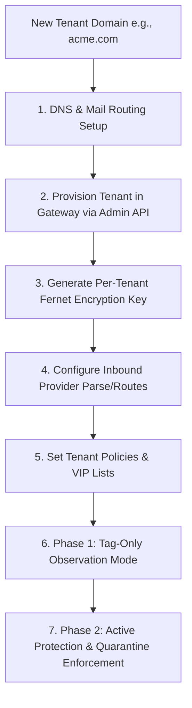
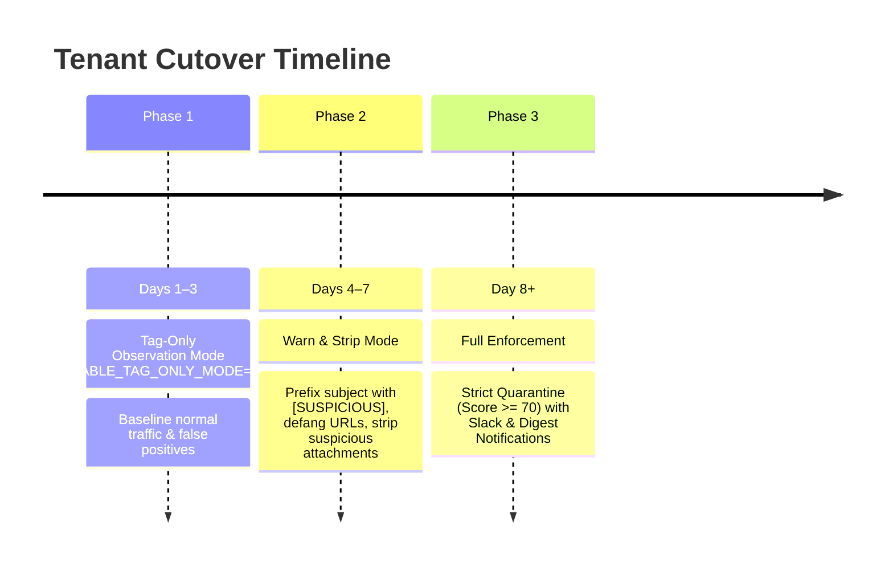

# New-Tenant Onboarding Guide — email-auth-gateway

This guide provides a comprehensive, step-by-step walkthrough for onboarding a new organization, subsidiary, or enterprise customer onto `email-auth-gateway`. 

The gateway supports true multi-tenancy: each tenant receives cryptographically isolated quarantine storage, per-tenant Fernet encryption keys, custom risk scoring thresholds, rate limits, and executive VIP impersonation lists.

---

## Onboarding Architecture



---

## Prerequisites Checklist

Before beginning onboarding, gather the following tenant information:

1. **Primary and Alias Domains**: All domains receiving mail (e.g., `acme.com`, `acmecorp.io`).
2. **Inbound Mail Provider**: The service handling the tenant's public MX records (SendGrid, Mailgun, AWS SES, Microsoft 365, or Google Workspace).
3. **Downstream Relay / Destination Server**: The internal mail server or cloud tenant where verified clean emails must be relayed (e.g., `smtp.office365.com` or `mail.internal.acme.com`).
4. **Key Executive / VIP Names**: CEO, CFO, and payroll administrators to protect against display-name spoofing.
5. **SecOps Contact**: Webhook or email endpoint for quarantine notifications.

---

## Step 1: Generate Tenant Cryptographic Key

Every tenant's quarantined messages and raw `.eml` files are encrypted at rest with a unique Fernet key. Generate this key in your secure terminal:

```bash
python3 -c "from cryptography.fernet import Fernet; print(Fernet.generate_key().decode())"
```
*Example Output:* `9h8Z6K1pX...=` (store this securely in HashiCorp Vault, AWS Secrets Manager, or GCP Secret Manager).

---

## Step 2: Register Tenant via Admin API

Call the gateway's `/admin/tenants` endpoint using your `ADMIN_SHARED_SECRET` bearer token:

### HTTP Request

```bash
curl -X POST https://email-security.example.com/admin/tenants \
  -H "Authorization: Bearer <ADMIN_SHARED_SECRET>" \
  -H "Content-Type: application/json" \
  -d '{
    "tenant_id": "tenant_acme",
    "name": "Acme Corporation",
    "domains": ["acme.com", "acmecorp.io"],
    "encryption_key": "<TENANT_FERNET_KEY>",
    "warn_threshold": 35,
    "quarantine_threshold": 70,
    "max_requests_per_minute": 600,
    "vt_api_key": "",
    "gsb_api_key": ""
  }'
```

### Python SDK / Script Example

```python
from multi_tenancy import TenantManager, TenantIsolatedQuarantine

manager = TenantManager()
tenant = manager.create_tenant(
    tenant_id="tenant_acme",
    name="Acme Corporation",
    domains=["acme.com", "acmecorp.io"],
    encryption_key="<GENERATED_FERNET_KEY>",
    warn_threshold=35,
    quarantine_threshold=70,
    max_requests_per_minute=600,
)
print(f"Tenant {tenant.tenant_id} onboarded successfully.")
```

---

## Step 3: Configure Inbound Mail Provider Routing

Configure the tenant's public mail flow to deliver inbound messages to the gateway.

### Option A: SendGrid Inbound Parse
1. Log in to [SendGrid Inbound Parse Settings](https://app.sendgrid.com/settings/parse).
2. Click **Add Host & URL**.
3. **Host Name**: `mail.acme.com` (point tenant's MX record to `mx.sendgrid.net`).
4. **URL**: `https://email-security.example.com/webhooks/sendgrid/inbound/<WEBHOOK_SHARED_SECRET>`
5. Check **Check incoming emails for spam** (optional) and select **POST the raw, full MIME message**.

### Option B: Mailgun Inbound Routes
1. Go to [Mailgun Routes](https://app.mailgun.com/app/routes).
2. Create a route matching the recipient domain:
   - **Expression Filter**: `match_recipient(".*@acme.com")`
   - **Action**: `forward("https://email-security.example.com/webhooks/mailgun/inbound")`
3. Verify that `MAILGUN_SIGNING_KEY` is configured in your gateway `.env`.

### Option C: Microsoft 365 (Exchange Online)
1. In the Microsoft 365 Exchange Admin Center, navigate to **Mail Flow > Connectors**.
2. Create an **Inbound Partner Connector**:
   - Sender domain: `*`
   - Restriction: Only accept mail from your gateway's outbound public IP addresses.
3. Update tenant DNS MX records to route through the gateway or SendGrid/Mailgun edge.

---

## Step 4: Configure VIP Protection & Domain Watchlists

Protect high-risk executives against business email compromise (BEC) and display name spoofing:

1. Update the tenant's policy configuration:
```json
{
  "vip_display_names": [
    "Alice Smith CEO",
    "Bob Jones CFO",
    "Carol White Controller"
  ],
  "watchlist_domains": [
    "acme.com",
    "acmecorp.io",
    "acme-supplier.com"
  ]
}
```
2. Any email received with a sender display name matching `"Alice Smith"` originating from an external domain will receive a **+40 BEC penalty**, immediately pushing unauthorized messages into quarantine.

---

## Step 5: Staged Rollout Strategy

To prevent disruptions or false-positive drops during onboarding, adhere to the three-phase cutover schedule:



### Phase 1: Tag-Only Observation Mode (Days 1–3)
- Set `ENABLE_TAG_ONLY_MODE=true` for the tenant.
- All messages are delivered to downstream mailboxes.
- The gateway appends diagnostic headers:
  ```http
  X-Gateway-Verdict: PASS
  X-Gateway-Score: 15
  X-Gateway-Tenant: tenant_acme
  ```
- Review the SOC Dashboard at `/ui/` to review verdict distributions and adjust custom thresholds.

### Phase 2: Warning & Defanging (Days 4–7)
- Enable `WARN_AND_STRIP` action.
- Suspicious links are defanged (`https://` becomes `hxxps://`).
- Users receive clear warning banners without missing legitimate emails.

### Phase 3: Full Enforcement (Day 8+)
- Enable active quarantine.
- Threats (score ≥ 70 or malware hits) are encrypted into `/quarantine/tenant_acme/` and held for review.

---

## Step 6: Verification & End-to-End Testing

Test tenant isolation and pipeline evaluation using the built-in test suite:

```bash
# Test inbound delivery for tenant domain
curl -X POST https://email-security.example.com/webhooks/sendgrid/inbound/<WEBHOOK_SHARED_SECRET> \
  -F "from=Billing Department <spoofed-vendor@malicious.com>" \
  -F "to=accounting@acme.com" \
  -F "subject=URGENT: Outstanding Invoice Payment Required" \
  -F "text=Please review the attached wire instructions immediately."

# Inspect quarantined item in tenant's isolated directory
ls -lh /tmp/email-gateway-quarantine/tenant_acme/
```

---

## Tenant Offboarding

When a tenant is decommissioned, execute the offboarding workflow:
1. Re-point tenant MX records away from the gateway.
2. Call the offboarding API:
   ```bash
   curl -X DELETE https://email-security.example.com/admin/tenants/tenant_acme \
     -H "Authorization: Bearer <ADMIN_SHARED_SECRET>"
   ```
3. Archive or purge the tenant's isolated quarantine directory according to your compliance data retention policy (e.g. 90-day retention).
